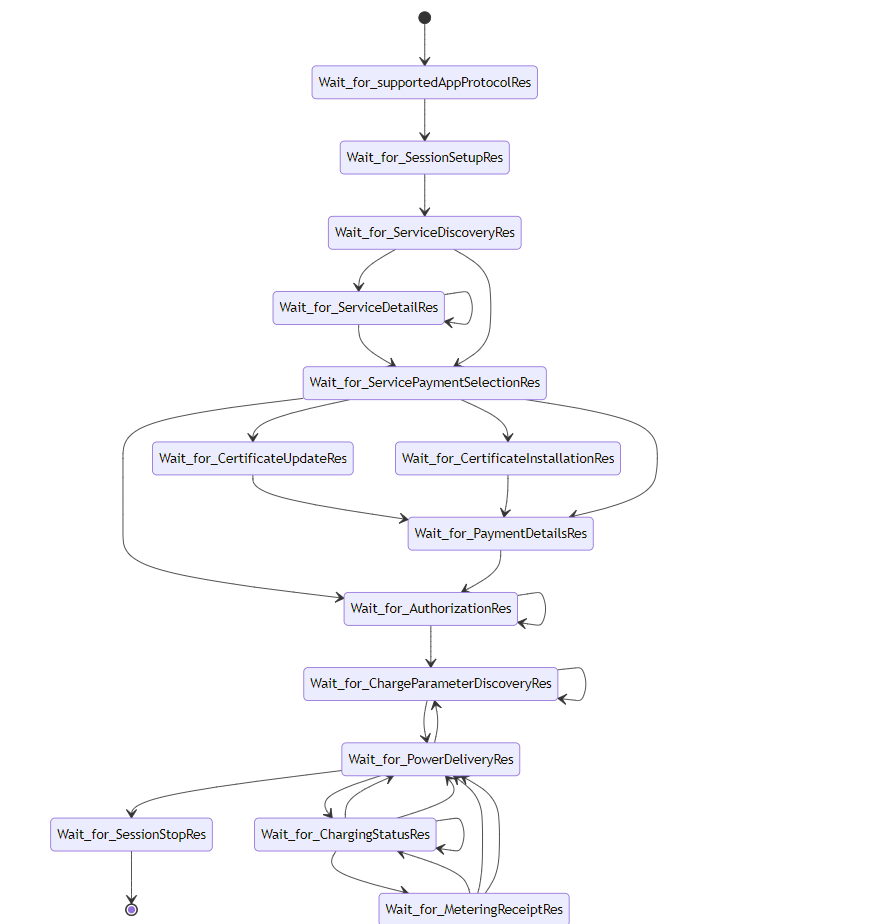
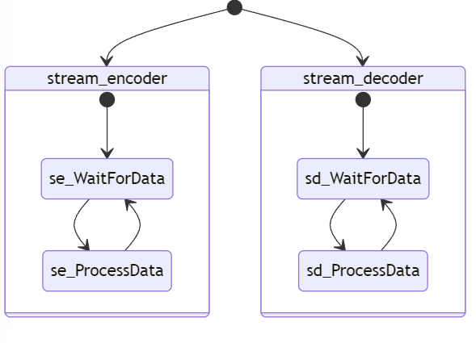

## Generate a mermaidjs conformant representation of a ceps state machine, i.e. ceps to mermaidjs.

### Synopsis: $ ceps FILE [FILES] sm2mermaidjs.ceps

Example (assuming this README's directory is the current working directory): 

```
$ ceps ../examples_ceps_sm/iso15118-2-evcc_communication_states_ac_v2g.ceps sm2mermaidjs.ceps 
```

Output:
```
stateDiagram-v2
  [*] --> Wait_for_supportedAppProtocolRes
  Wait_for_supportedAppProtocolRes --> Wait_for_SessionSetupRes
  Wait_for_SessionSetupRes --> Wait_for_ServiceDiscoveryRes
  Wait_for_ServiceDiscoveryRes --> Wait_for_ServiceDetailRes
  Wait_for_ServiceDetailRes --> Wait_for_ServiceDetailRes
  Wait_for_ServiceDetailRes --> Wait_for_ServicePaymentSelectionRes
  Wait_for_ServiceDiscoveryRes --> Wait_for_ServicePaymentSelectionRes
  Wait_for_ServicePaymentSelectionRes --> Wait_for_CertificateInstallationRes
  Wait_for_ServicePaymentSelectionRes --> Wait_for_CertificateUpdateRes
  Wait_for_CertificateUpdateRes --> Wait_for_PaymentDetailsRes
  Wait_for_CertificateInstallationRes --> Wait_for_PaymentDetailsRes
  Wait_for_ServicePaymentSelectionRes --> Wait_for_PaymentDetailsRes
  Wait_for_ServicePaymentSelectionRes --> Wait_for_AuthorizationRes
  Wait_for_PaymentDetailsRes --> Wait_for_AuthorizationRes
  Wait_for_AuthorizationRes --> Wait_for_AuthorizationRes
  Wait_for_AuthorizationRes --> Wait_for_ChargeParameterDiscoveryRes
  Wait_for_ChargeParameterDiscoveryRes --> Wait_for_ChargeParameterDiscoveryRes
  Wait_for_ChargeParameterDiscoveryRes --> Wait_for_PowerDeliveryRes
  Wait_for_PowerDeliveryRes --> Wait_for_ChargeParameterDiscoveryRes
  Wait_for_PowerDeliveryRes --> Wait_for_SessionStopRes
  Wait_for_PowerDeliveryRes --> Wait_for_ChargingStatusRes
  Wait_for_ChargingStatusRes --> Wait_for_PowerDeliveryRes
  Wait_for_ChargingStatusRes --> Wait_for_PowerDeliveryRes
  Wait_for_ChargingStatusRes --> Wait_for_ChargingStatusRes
  Wait_for_ChargingStatusRes --> Wait_for_MeteringReceiptRes
  Wait_for_MeteringReceiptRes --> Wait_for_ChargingStatusRes
  Wait_for_MeteringReceiptRes --> Wait_for_PowerDeliveryRes
  Wait_for_MeteringReceiptRes --> Wait_for_PowerDeliveryRes
  Wait_for_SessionStopRes --> [*]
```

Example as rendered by mermaid.live:





Second example with compound states: 

```
$ ceps ../examples_ceps_sm/exi-proc-cconceptual.ceps sm2mermaidjs.ceps 
```

Output:
```
stateDiagram-v2
state stream_encoder{
  [*] --> se_WaitForData
  se_WaitForData --> se_ProcessData
  se_ProcessData --> se_WaitForData
}
state stream_decoder{
  [*] --> sd_WaitForData
  sd_WaitForData --> sd_ProcessData
  sd_ProcessData --> sd_WaitForData
}
  [*] --> stream_encoder
  [*] --> stream_decoder
```


