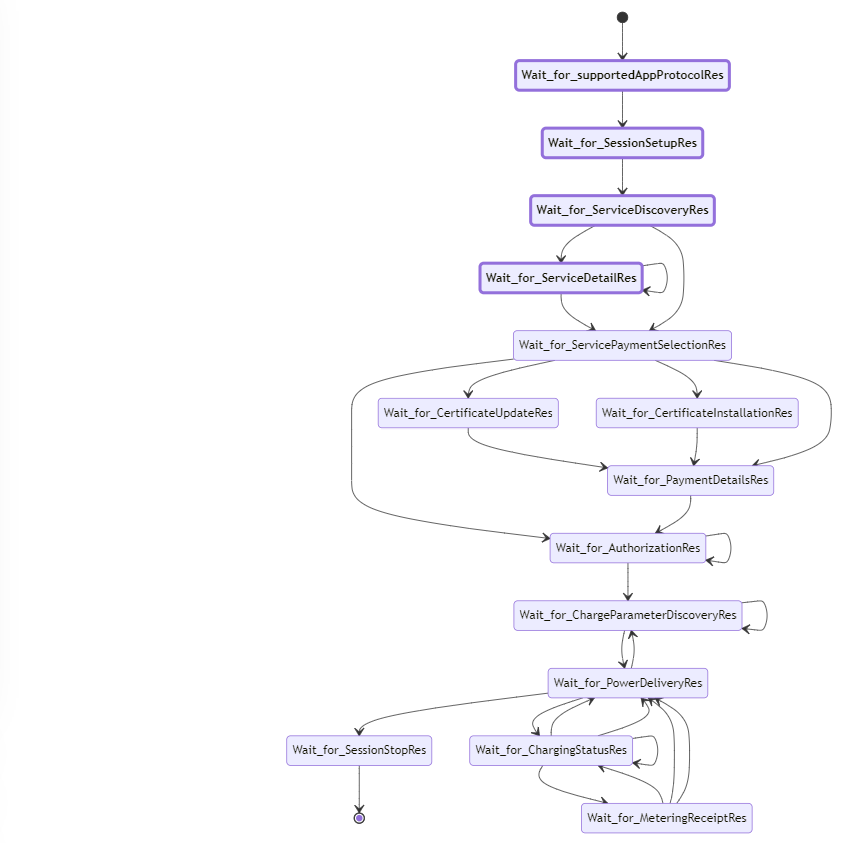

ceps ../examples_ceps_sm/iso15118-2-evcc_communication_states_ac_v2g.ceps sim.ceps  --post_processing sm2mermaidjs_mark_visited_states.ceps --quiet

# Generate a mermaid.js conformant representation of a ceps state machine where the visited states are highlighted, i.e. ceps with trace to annotated mermaid.js.

Synopsis: $ ceps FILE [FILES] SIMULATION-FILE  --post_processing sm2mermaidjs_mark_visited_states.ceps --quiet

Example (assuming this README's directory is the current working directory): 

```
$ ceps ../examples_ceps_sm/iso15118-2-evcc_communication_states_ac_v2g.ceps sim.ceps  --post_processing sm2mermaidjs_mark_visited_states.ceps --quiet 
```

Output:
```
stateDiagram-v2

  classDef visited font-weight:bold,stroke-width:4px

  [*] --> Wait_for_supportedAppProtocolRes
  Wait_for_supportedAppProtocolRes --> Wait_for_SessionSetupRes
  Wait_for_SessionSetupRes --> Wait_for_ServiceDiscoveryRes
  Wait_for_ServiceDiscoveryRes --> Wait_for_ServiceDetailRes
  Wait_for_ServiceDetailRes --> Wait_for_ServiceDetailRes
  Wait_for_ServiceDetailRes --> Wait_for_ServicePaymentSelectionRes
  Wait_for_ServiceDiscoveryRes --> Wait_for_ServicePaymentSelectionRes
  Wait_for_ServicePaymentSelectionRes --> Wait_for_CertificateInstallationRes
  Wait_for_ServicePaymentSelectionRes --> Wait_for_CertificateUpdateRes
  Wait_for_CertificateUpdateRes --> Wait_for_PaymentDetailsRes
  Wait_for_CertificateInstallationRes --> Wait_for_PaymentDetailsRes
  Wait_for_ServicePaymentSelectionRes --> Wait_for_PaymentDetailsRes
  Wait_for_ServicePaymentSelectionRes --> Wait_for_AuthorizationRes
  Wait_for_PaymentDetailsRes --> Wait_for_AuthorizationRes
  Wait_for_AuthorizationRes --> Wait_for_AuthorizationRes
  Wait_for_AuthorizationRes --> Wait_for_ChargeParameterDiscoveryRes
  Wait_for_ChargeParameterDiscoveryRes --> Wait_for_ChargeParameterDiscoveryRes
  Wait_for_ChargeParameterDiscoveryRes --> Wait_for_PowerDeliveryRes
  Wait_for_PowerDeliveryRes --> Wait_for_ChargeParameterDiscoveryRes
  Wait_for_PowerDeliveryRes --> Wait_for_SessionStopRes
  Wait_for_PowerDeliveryRes --> Wait_for_ChargingStatusRes
  Wait_for_ChargingStatusRes --> Wait_for_PowerDeliveryRes
  Wait_for_ChargingStatusRes --> Wait_for_PowerDeliveryRes
  Wait_for_ChargingStatusRes --> Wait_for_ChargingStatusRes
  Wait_for_ChargingStatusRes --> Wait_for_MeteringReceiptRes
  Wait_for_MeteringReceiptRes --> Wait_for_ChargingStatusRes
  Wait_for_MeteringReceiptRes --> Wait_for_PowerDeliveryRes
  Wait_for_MeteringReceiptRes --> Wait_for_PowerDeliveryRes
  Wait_for_SessionStopRes --> [*]

  class Wait_for_supportedAppProtocolRes visited
  class Wait_for_SessionSetupRes visited
  class Wait_for_ServiceDiscoveryRes visited
  class Wait_for_ServiceDetailRes visited
```

Example as rendered by mermaid.live:



